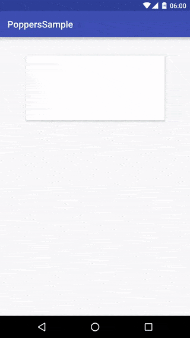
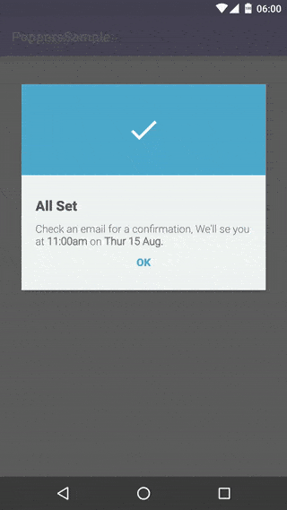
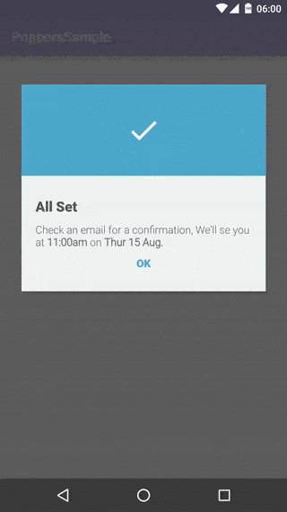
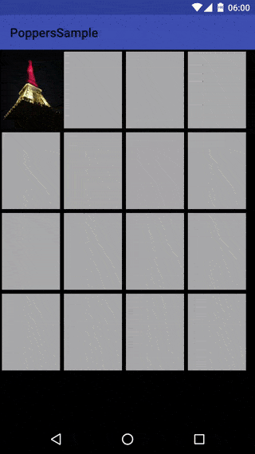

MaryPopup
=======

[][repo]
[][androidarsenal]

Expand your view with no problem ;) 

[][repo]

# Usage

Open marypopup from a view

```java
MaryPopup marypopup = MaryPopup.with(context)
                        .cancellable(true)
                        .blackOverlayColor(Color.parseColor("#DD444444"))
                        .backgroundColor(Color.parseColor("#EFF4F5"))
                        .content(R.layout.popup_content)
                        .from(clickedView)
                        .show();
```

```java
CustomView customView = LayoutInflater...
MaryPopup marypopup = MaryPopup.with(context)
                        .cancellable(true)
                        .blackOverlayColor(Color.parseColor("#DD444444"))
                        .backgroundColor(Color.parseColor("#EFF4F5"))
                        .content(customView)
                        .from(clickedView)
                        .show();
```

# Center

[][repo]

```java
MaryPopup marypopup = MaryPopup.with(context)
                        ...
                        .center(true)
                        ...
                        .show();
```

# Draggable

[][repo]

```java
MaryPopup.with(context)
      ...
      .draggable(true)
      ...
      .show();
```

[][repo]

```java
MaryPopup.with(context)
      ...
      .draggable(true)
      .scaleDownDragging(true);
      ...
      .show();
```

[][repo]

```java
MaryPopup.with(context)
      ...
      .draggable(true)
      .fadeOutDragging(true);
      ...
      .show();
```

# Close

Don't forget to handle the activity's `onBackPress`

```java
@Override
public void onBackPressed() {
    if(!marypopup.close(true)){
        super.onBackPressed();
    }
}
```

[][photo]

# Download

Add into your **build.gradle**

[  ](https://bintray.com/meetic-android/maven/MaryPopup/_latestVersion)
 
```groovy
compile 'com.meetic.marypopup:marypopup:(last version)
compile 'com.meetic.dragueur:dragueur:1.0.0'
```

# Credits

A project initiated by Meetic

This project was first developed by Meetic and has been open-sourced since. We will continue working on it.
We encourage the community to contribute to the project by opening tickets and/or pull requests.

[][meetic]

Contributor: [Florent Champigny][florent]  

# License

    Copyright 2016 Meetic, Inc.

    Licensed under the Apache License, Version 2.0 (the "License");
    you may not use this file except in compliance with the License.
    You may obtain a copy of the License at

       http://www.apache.org/licenses/LICENSE-2.0

    Unless required by applicable law or agreed to in writing, software
    distributed under the License is distributed on an "AS IS" BASIS,
    WITHOUT WARRANTIES OR CONDITIONS OF ANY KIND, either express or implied.
    See the License for the specific language governing permissions and
    limitations under the License.

[repo]: https://github.com/Meetic/MaryPopup
[androidarsenal]: http://android-arsenal.com/details/--------
[meetic]: http://www.meetic.fr/
[dragueur]: https://github.com/-----
[florent]: https://github.com/florent37
